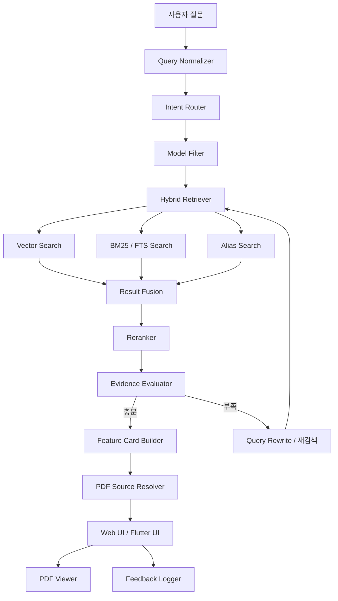
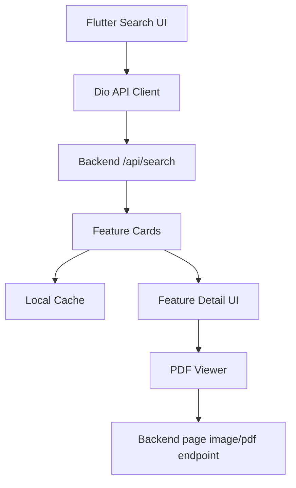

# Panasonic LUMIX Manual Assistant 초기 설계 문서

> GCSE 프레임워크 기반 제품 매뉴얼 검색·상담형 RAG 시스템 설계서  
> 1차 구현: Web 서비스  
> 2차 구현: Flutter 모바일 앱  
> 대상 문서: Panasonic LUMIX 한국어 PDF 매뉴얼

---

## 0. 문서 정보

| 항목 | 내용 |
|---|---|
| 문서명 | Panasonic LUMIX Manual Assistant 초기 설계 문서 |
| 목적 | 파나소닉 카메라 PDF 매뉴얼 기반 기능 검색 챗봇의 기획, 아키텍처, 기술 스택, 단계별 구현 계획 정리 |
| 작성 기준 | GCSE 프레임워크: Goal, Context, Sources, Expectations |
| 1차 산출물 | 웹 기반 기능 검색 챗봇 + 기능 카드 + PDF 페이지 뷰어 |
| 2차 산출물 | Flutter 기반 모바일 앱 |
| 핵심 키워드 | Hybrid RAG, Feature Wiki LLM, Wiki-derived Graph-lite, 기능 카드, PDF 페이지 출처, 모델별 기능 비교 |
| 우선 대상 브랜드 | Panasonic LUMIX |
| 우선 대상 언어 | 한국어 |
| 주요 사용 문서 | DC-G9M2, DC-S1M2, DC-TZ99/DC-ZS99, DMC-G85 한국어 PDF 매뉴얼 |

---

## 1. 프로젝트 한 줄 정의

**Panasonic LUMIX 카메라의 한국어 PDF 매뉴얼을 기반으로 사용자의 자연어 기능 질문을 해석하고, 모델별 기능 요약 카드와 공식 PDF 출처 페이지를 제공하는 제품 지원형 RAG 챗봇**을 만든다.

---

## 2. GCSE 프레임워크 개요

GCSE 프레임워크는 요청이나 기획을 다음 네 가지 축으로 정리하는 방식이다.

| 구분 | 의미 | 이 문서에서의 적용 |
|---|---|---|
| G — Goal | 달성하려는 목표 | 사용자가 원하는 카메라 기능을 빠르게 찾고, 요약 카드와 출처 페이지를 제공한다. |
| C — Context | 배경과 제약 | 공식 사이트 탐색이 어렵고, PDF 매뉴얼은 길며, 모델별 기능 차이가 크다. |
| S — Sources | 사용할 근거 자료 | Panasonic LUMIX 한국어 PDF 매뉴얼, 페이지 텍스트, 목차, 기능별 목차, 메뉴 목록, 문제해결 섹션 |
| E — Expectations | 기대 산출물과 품질 기준 | 기능 카드, PDF 상세 보기, 모델 필터, 출처 표시, 오염 방지, 웹 MVP, Flutter 앱 |

---

# Part A. G — Goal

## 3. 프로젝트 목표

### 3.1 핵심 목표

사용자가 다음과 같이 자연어로 질문하면:

```text
움직이는 피사체 초점 잘 잡으려면?
동영상 흔들림 줄이는 기능 있어?
사진 찍고 나서 초점 고르는 기능 뭐야?
스트리밍 가능한 모델이 있어?
충전 램프가 깜박이는데 무슨 뜻이야?
G9M2에서 제브라 패턴 어디서 설정해?
```

시스템은 다음을 제공한다.

```text
1. 관련 기능명
2. 해당 기능을 지원하는 모델
3. 기능 요약
4. 사용 방법
5. 메뉴 경로
6. 주의사항
7. 관련 기능
8. 공식 PDF 출처
9. PDF 상세 보기 페이지 링크
```

---

## 4. 제품 목표

### 4.1 사용자 관점 목표

| 사용자 문제 | 해결 방식 |
|---|---|
| 공식 사이트에서 원하는 정보를 찾기 어렵다 | 자연어 검색으로 기능을 찾는다. |
| PDF 매뉴얼이 너무 길다 | 기능별 카드로 요약한다. |
| 기능명을 정확히 모른다 | 별칭 사전과 의미 검색으로 연결한다. |
| 모델마다 기능명이 다르거나 앱 이름이 다르다 | 모델별 필터와 기능 지원 여부를 표시한다. |
| 답변이 맞는지 확인하고 싶다 | PDF 문서명, 페이지, 섹션, 상세 보기 링크를 제공한다. |
| 문제 해결 정보를 빠르게 찾고 싶다 | Q&A, 메시지 표시, 문제해결 섹션을 별도 카테고리로 검색한다. |

### 4.2 포트폴리오 관점 목표

이 프로젝트는 단순 질의응답 챗봇이 아니라 다음 역량을 보여주는 실무형 포트폴리오다.

```text
- PDF 기반 RAG 파이프라인 설계
- 한국어 매뉴얼 문맥 인식
- Hybrid Search 구현
- 기능 카드형 응답 UI 설계
- 출처 기반 답변 생성
- PDF 페이지 뷰어 연동
- 모델별 정보 오염 방지
- 웹 MVP 구현
- Flutter 앱 확장 설계
- 검색 품질 평가 및 피드백 루프 설계
```

---

## 5. 성공 기준

### 5.1 MVP 성공 기준

| 기준 | 목표 |
|---|---|
| 기능 검색 정확도 | 테스트 질문 기준 Top-5 검색 결과 안에 정답 기능 포함률 85% 이상 |
| 출처 정확도 | 기능 카드의 PDF 페이지 링크가 실제 관련 페이지로 이동하는 비율 95% 이상 |
| 모델 구분 정확도 | 선택한 모델과 다른 모델의 기능이 섞이는 비율 3% 이하 |
| 응답 형식 안정성 | 기능 카드 JSON schema validation 통과율 98% 이상 |
| 근거 없는 답변 방지 | 공식 문서 근거가 없을 때 “근거 부족” 처리 가능 |
| 웹 데모 완성도 | 검색, 카드, 상세 보기, PDF 페이지 이동까지 동작 |
| 포트폴리오 완성도 | README, 아키텍처 다이어그램, API 문서, 시연 영상 또는 스크린샷 포함 |

### 5.2 장기 성공 기준

| 기준 | 목표 |
|---|---|
| 모델 비교 | “G9M2와 S1M2의 동영상 기능 차이” 같은 비교 질의 지원 |
| 문제 해결 | 충전, 카드, Wi-Fi, 앱 연결, 촬영 오류 관련 가이드 제공 |
| 모바일 앱 | Flutter 앱에서 검색, 카드, PDF 상세 보기 제공 |
| 운영성 | 새 PDF 추가 시 자동 색인 가능 |
| 확장성 | Panasonic 외 다른 카메라 브랜드 매뉴얼도 추가 가능 |

---

# Part B. C — Context

## 6. 문제 배경

Panasonic LUMIX 카메라는 기능이 많고 모델별 차이가 크다. 그러나 국내 사용자가 정보를 찾을 때 다음 문제가 발생한다.

```text
- 한국어 지원 페이지 탐색이 어렵다.
- PDF 매뉴얼은 길고 기능별로 흩어져 있다.
- 최신 모델과 구형 모델의 앱, 메뉴, 기능명이 다르다.
- 사용자는 정확한 기능명을 모르는 상태로 질문한다.
- 매뉴얼 안의 목차, 기능별 목차, 메뉴 목록, 문제해결 섹션을 직접 뒤져야 한다.
- 검색 결과가 나와도 어떤 모델에 해당하는지 확인하기 어렵다.
```

이 프로젝트는 “문서 검색”이 아니라 **제품 지원 경험을 개선하는 기능 탐색 시스템**으로 설계한다.

---

## 7. 대상 사용자

| 사용자 유형 | 니즈 |
|---|---|
| 일반 카메라 사용자 | 기능명을 몰라도 사용법을 찾고 싶다. |
| 영상 촬영 사용자 | 동영상, 손떨림 보정, 로그 촬영, 스트리밍, HDMI 출력 같은 기능을 빠르게 찾고 싶다. |
| 사진 촬영 사용자 | AF, 초점, 노출, 브래킷, 포스트 포커스, 플래시 기능을 찾고 싶다. |
| 판매/상담 담당자 | 고객 질문에 모델별로 빠르게 답하고 싶다. |
| 중고 구매자 | 특정 모델이 원하는 기능을 지원하는지 확인하고 싶다. |
| A/S·기술지원 담당자 | 문제해결, 메시지 표시, 충전, 카드, Wi-Fi 연결 문제를 빠르게 찾고 싶다. |

---

## 8. 서비스 형태

### 8.1 1차: FastAPI 서빙 정적 웹 UI

웹 MVP는 포트폴리오의 핵심 시연 대상이며, 초기 구현은 FastAPI가 정적 웹사이트를 서빙하는 구조를 기본으로 한다.
여기서 “정적”은 HTML/CSS/JavaScript 프론트엔드 빌드 산출물의 서빙 방식을 뜻한다.
검색·카드 생성·출처 검증은 FastAPI Backend API에서 Hybrid RAG → Feature Wiki LLM → Wiki-derived Graph-lite → Guided Support Assistant 흐름으로 확장 가능한 구조로 설계한다.

```text
- 웹 브라우저에서 자연어 검색
- 모델 필터 제공
- 기능 카드 목록 표시
- 카드 상세 보기
- PDF 페이지 뷰어 연동
- 출처 페이지 하이라이트
- FastAPI 검색 API 연동
- 검색 로그 및 피드백 수집
```

추천 UI 구조:

```text
┌──────────────────────────────────────────────────────┐
│ Header: Panasonic LUMIX Manual Assistant              │
├───────────────┬───────────────────────┬──────────────┤
│ 모델 필터      │ 검색창 + 기능 카드       │ PDF 뷰어      │
│ 카테고리 필터   │ 요약/사용법/주의사항     │ page 이동     │
│ 출처 문서 필터   │ 관련 기능/지원 모델      │ 하이라이트    │
└───────────────┴───────────────────────┴──────────────┘
```

### 8.2 2차: Flutter 앱

Flutter 앱은 웹 MVP 이후 확장한다.

```text
- 모바일 검색 UX
- 즐겨찾기 기능
- 최근 본 기능
- 모델별 즐겨찾기
- PDF 페이지 모바일 뷰어
- 오프라인 캐시 일부 지원
- 촬영 현장에서 빠른 기능 검색
```

---

## 9. 주요 제약 조건

| 제약 | 설계 대응 |
|---|---|
| PDF가 길고 구조가 복잡함 | 페이지 단위 + 섹션 단위 + 기능 단위 chunk를 병행한다. |
| 모델별 기능명이 비슷함 | document_id, model_id, product_line metadata를 강제한다. |
| 기능명을 모르는 질문이 많음 | 한국어 기능 별칭 사전과 query normalization을 사용한다. |
| 답변 오염 위험 | 공식 PDF source_ref가 없는 내용은 카드에 넣지 않는다. |
| PDF 표와 이미지가 있음 | 페이지 이미지를 저장하고 PDF viewer에서 원문 확인을 제공한다. |
| 구형/신형 모델 앱 이름이 다름 | 모델별 앱명, 메뉴명, 연결 기능을 별도로 저장한다. |
| 상용 배포 시 저작권 이슈 가능 | 포트폴리오 공개 범위에서 PDF 원문 제공 방식과 라이선스 검토가 필요하다. |

---

# Part C. S — Sources

## 10. 초기 사용 문서

초기 데이터셋은 다음 PDF로 구성한다.

| document_id | 파일명 | 모델 | 문서 성격 | 우선 색인 대상 |
|---|---|---|---|---|
| dc_g9m2_full_kor | DC-G9M2_DVQP3025_full_kor.pdf | DC-G9M2 | 전체 안내서 | 목차, 기능 섹션, 메뉴 목록, 문제해결, 사양 |
| dc_s1m2_full_kor | DC-S1M2_DVQP3242_full_kor.pdf | DC-S1M2 | 전체 안내서 | 동영상, LUMIX Lab, Frame.io, LUMIX Flow, 스트리밍, 테더링, 사양 |
| dc_tz99_zs99_full_kor | DC-TZ99_ZS99_DVQP3300_full_kor.pdf | DC-TZ99 / DC-ZS99 | 고급 기능 사용 설명서 | 필요한 정보 검색, 기능별 목차, 메뉴 목록, Q&A 문제해결 |
| dmc_g85_full_kor | DMC-G85_DVQP1024ZA_kor.pdf | DMC-G85 | 고급 기능 사용 설명서 | 기능별 목록, 메뉴 목록, 문제해결, Wi-Fi 기능 |

---

## 11. 문서 관찰 사항

초기 문서들은 기능 검색 서비스에 적합한 구조를 이미 일부 갖고 있다.

```text
- DC-G9M2, DC-S1M2 문서는 “전체 안내서” 형식으로 카메라의 모든 기능과 조작 설명을 포함한다.
- DC-TZ99/DC-ZS99 문서는 필요한 정보 검색, 기능별 목차, 메뉴 목록, Q&A 문제 해결 구조를 제공한다.
- DMC-G85 문서는 사용자가 필요로 하는 정보 찾기, 기능별 목록, 메뉴 목록, 문제해결 구조를 제공한다.
- DC-S1M2는 LUMIX Lab, LUMIX Flow, Frame.io Camera to Cloud, 스트리밍 기능 등 최신 연결 기능을 포함한다.
```

이 구조는 다음 처리에 유리하다.

```text
- 목차 기반 섹션 추출
- 기능별 목차 기반 feature seed 생성
- 메뉴 목록 기반 menu_path 추출
- 문제해결 섹션 기반 support intent 분류
- PDF 페이지 링크 기반 상세 보기 연동
```

---

## 12. Source 정책

### 12.1 원천 자료 우선순위

| 우선순위 | 자료 | 사용 방식 |
|---|---|---|
| 1 | 공식 PDF 원문 페이지 | 최종 근거 |
| 2 | PDF에서 추출한 page text | 검색 및 근거 추출 |
| 3 | PDF 목차/기능별 목차/메뉴 목록 | feature seed 및 navigation index |
| 4 | Feature Wiki | 검색 보조와 요약 보조 |
| 5 | 사용자 피드백 | 품질 개선용, 공식 근거로 사용하지 않음 |
| 6 | 외부 웹 | 초기 MVP에서는 사용하지 않음 |

### 12.2 답변에 사용할 수 있는 정보

```text
사용 가능:
- 공식 PDF에서 추출된 페이지 텍스트
- 공식 PDF의 페이지 이미지
- 출처가 연결된 feature wiki summary
- 출처가 연결된 메뉴 경로
- 출처가 연결된 주의사항

사용 금지:
- 출처 없는 모델 추정
- 다른 모델 PDF의 기능을 현재 모델 기능처럼 설명
- 사용자 피드백을 공식 기능처럼 설명
- 문서 밖 일반 지식으로 기능 지원 여부 단정
- 외부 웹 정보와 공식 PDF 정보 혼합
```

---

## 13. Source metadata 설계

모든 chunk, feature, card에는 다음 metadata를 강제한다.

```json
{
  "brand": "Panasonic",
  "product_line": "LUMIX",
  "model_id": "DC-S1M2",
  "document_id": "dc_s1m2_full_kor",
  "document_title": "사용 설명서 <전체 안내서>",
  "source_type": "official_manual_pdf",
  "language": "ko",
  "page_start": 816,
  "page_end": 820,
  "section_title": "스트리밍 기능",
  "feature_category": "connectivity",
  "manual_revision": "DVQP3242ZD",
  "publication_context": "F0525TN3036",
  "is_official_source": true,
  "is_user_generated": false,
  "hash": "sha256..."
}
```

---

# Part D. E — Expectations

## 14. 기대 산출물

### 14.1 웹 MVP 산출물

```text
- PDF 업로드 및 색인 관리자 화면
- 모델별 문서 목록
- 자연어 검색 화면
- 기능 카드 리스트
- 기능 상세 패널
- PDF 페이지 뷰어
- 출처 페이지 이동
- 검색 로그 저장
- 사용자 피드백 버튼
```

### 14.2 Flutter 앱 산출물

```text
- 모바일 검색 화면
- 모델 선택 화면
- 기능 카드 화면
- PDF 상세 보기 화면
- 즐겨찾기
- 최근 검색
- 로컬 캐시
- API 연동
```

### 14.3 문서 산출물

```text
- 프로젝트 README
- 초기 설계 문서
- API 명세서
- 데이터베이스 ERD
- RAG 파이프라인 다이어그램
- 검색 품질 평가 리포트
- 시연용 질문셋
- 포트폴리오 발표 자료
```

---

## 15. 사용자 응답 카드 예시

```json
{
  "feature_id": "zoom_compose_assist",
  "feature_name": "줌 컴포즈 보조",
  "category": "촬영 보조",
  "summary": "망원 줌 중 피사체를 놓쳤을 때 일시적으로 줌 배율을 낮춰 피사체를 다시 찾을 수 있게 돕는 기능입니다.",
  "supported_models": [
    {
      "model_id": "DC-TZ99",
      "support_status": "supported"
    },
    {
      "model_id": "DC-ZS99",
      "support_status": "supported"
    }
  ],
  "how_to_use": [
    "[줌 컴포즈 보조] 버튼을 누릅니다.",
    "피사체를 화면 중앙 프레임에 다시 맞춥니다.",
    "버튼에서 손을 떼면 원래 줌 배율로 돌아갑니다."
  ],
  "menu_path": null,
  "cautions": [
    "정확한 제한 사항은 출처 페이지에서 확인합니다."
  ],
  "sources": [
    {
      "document_id": "dc_tz99_zs99_full_kor",
      "model_id": "DC-TZ99/DC-ZS99",
      "page": 36,
      "section_title": "[줌 컴포즈 보조] 버튼",
      "viewer_url": "/viewer/dc_tz99_zs99_full_kor?page=36"
    }
  ],
  "confidence": 0.92
}
```

---

## 16. 응답 품질 원칙

```text
1. 기능 지원 여부는 모델별로 분리한다.
2. 기능 카드에는 최소 1개 이상의 공식 PDF source_ref가 있어야 한다.
3. PDF 페이지를 찾지 못하면 기능 카드를 확정하지 않는다.
4. 모델을 선택한 질문에서는 해당 모델 문서만 우선 검색한다.
5. 여러 모델 비교 질문에서는 모델별 근거를 각각 표시한다.
6. 검색 결과가 약하면 “근거 부족” 또는 “관련 후보”로 표시한다.
7. 사용자가 입력한 표현을 기능명으로 단정하지 않고 후보 기능을 제시한다.
8. Feature Wiki는 원문 탐색 지도이며 최종 근거는 PDF 원문이다.
9. 앱 연결, 펌웨어, 스트리밍처럼 모델·지역·버전에 민감한 기능은 주의 문구를 표시한다.
10. 답변에는 항상 문서명, 모델명, 페이지, 섹션을 포함한다.
```

---

# Part E. 전체 아키텍처

## 17. 권장 발전 흐름

카메라 매뉴얼 프로젝트에 맞춘 권장 흐름은 다음이다.

```text
Hybrid RAG
→ Feature Wiki LLM
→ Wiki-derived Graph-lite
→ Guided Support Assistant
```

| 단계 | 역할 |
|---|---|
| Hybrid RAG | PDF 원문에서 정확한 기능 근거를 찾는다. |
| Feature Wiki LLM | 기능별 요약, 별칭, 메뉴 경로, 주의사항을 Markdown으로 정리한다. |
| Wiki-derived Graph-lite | 모델-기능-메뉴-문제해결 관계를 가볍게 구조화한다. |
| Guided Support Assistant | 사용자의 상황을 단계적으로 확인하며 문제 해결 또는 설정 안내를 제공한다. |

---

## 18. 시스템 흐름도



---

## 19. 데이터 흐름

```text
PDF 수집
  ↓
문서 등록
  ↓
페이지 텍스트 추출
  ↓
페이지 이미지 생성
  ↓
목차/기능별 목차/메뉴 목록 추출
  ↓
chunk 생성
  ↓
임베딩 생성
  ↓
Vector DB 저장
  ↓
BM25/FTS 색인
  ↓
Feature seed 생성
  ↓
Feature Wiki 생성
  ↓
검색/카드 응답
```

---

## 20. Hybrid RAG 검색 전략

### 20.1 왜 Hybrid RAG인가

카메라 매뉴얼 검색은 두 가지 검색이 모두 필요하다.

| 검색 방식 | 필요한 이유 | 예시 |
|---|---|---|
| 키워드/BM25 검색 | 정확한 기능명, 메뉴명, 모델명, 페이지 찾기 | “제브라 패턴”, “LUMIX Lab”, “카드 포맷” |
| 벡터 검색 | 사용자가 기능명을 모르는 자연어 질문 처리 | “밝은 부분 날아가는지 확인”, “스마트폰으로 찍기”, “나중에 초점 고르기” |
| 별칭 검색 | 한국어 표현과 매뉴얼 표현 연결 | “흔들림 줄이기” → “이미지 손떨림 보정” |

### 20.2 검색 단계

```text
1. 사용자 질문 정규화
2. 모델명 추출 또는 모델 필터 적용
3. 기능 별칭 확장
4. Vector Search 실행
5. BM25/FTS Search 실행
6. 메뉴/목차 인덱스 검색
7. RRF 또는 가중합으로 후보 병합
8. Reranker로 재정렬
9. Evidence Evaluator로 근거 적합성 검증
10. Feature Card 생성
```

### 20.3 점수 병합 예시

```text
final_score =
  0.40 * vector_score
+ 0.30 * bm25_score
+ 0.15 * alias_match_score
+ 0.10 * model_match_score
+ 0.05 * section_priority_score
```

초기 구현에서는 RRF를 사용해도 충분하다.

```text
RRF score = Σ 1 / (k + rank_i)
권장 k = 60
```

---

# Part F. 기술 스택 및 자원

## 21. 전체 기술 스택 요약

| 영역 | 1차 Web MVP 권장 | 2차 Flutter 앱 권장 | 대안 |
|---|---|---|---|
| Backend API | FastAPI + Hybrid RAG API + StaticFiles | 동일 FastAPI API 사용 | 추가 REST/Graph endpoints |
| Frontend Web | Static HTML/CSS/JavaScript | - | React + Vite, Next.js |
| Mobile | - | Flutter + Riverpod 또는 BLoC | Kotlin Multiplatform |
| PDF Parsing | PyMuPDF, pdfplumber | 서버 처리 결과 사용 | pypdf, unstructured |
| PDF Viewer | pdf.js | pdfx 또는 Syncfusion Flutter PDF Viewer | PSPDFKit 등 상용 SDK |
| Vector DB | Qdrant 우선, ChromaDB 대안 | 서버 API 사용 | pgvector, Weaviate |
| Keyword Search | SQLite FTS5 초기, OpenSearch 확장 | 서버 API 사용 | Elasticsearch, Meilisearch |
| RDB | SQLite 초기, PostgreSQL 확장 | 서버 API 사용 | MySQL |
| Object Storage | Local filesystem, MinIO, S3 | 서버 URL 사용 | Cloudflare R2 |
| Cache | 브라우저 캐시 | 앱 로컬 캐시 | Redis, Valkey |
| LLM Gateway | OpenAI-compatible adapter | 서버 API 사용 | LangServe, LiteLLM |
| Observability | 초기 없음 | Firebase Crashlytics 선택 | Sentry |
| Deployment | FastAPI + StaticFiles, Docker Compose, VPS | Play Store/TestFlight 준비 | Nginx reverse proxy |

---

## 22. 모델 구성 전략

### 22.1 LLM 역할 분리

LLM은 모든 것을 직접 답하는 용도가 아니라, 다음 역할에 제한해서 사용한다.

| 역할 | 설명 | 권장 모델 수준 |
|---|---|---|
| Query Normalizer | 사용자 질문을 기능명, 모델명, 의도, 별칭으로 정규화 | 빠른 소형 모델 |
| Feature Card Builder | 검색된 근거를 카드 JSON으로 정리 | 한국어 지시 수행이 좋은 중형 모델 |
| Feature Wiki Generator | PDF chunk를 기능별 Markdown으로 정리 | 긴 문맥 처리 가능한 중형 이상 모델 |
| Evidence Evaluator | 검색 결과가 질문에 맞는지 검증 | 빠른 소형/중형 모델 |
| Guided Support Assistant | 문제 해결 단계 질문 생성 | 중형 모델 |

### 22.2 LLM 후보

| 용도 | 상용 API 후보 | 로컬/오픈소스 후보 | 선택 기준 |
|---|---|---|---|
| Query Normalizer | GPT-4.1 mini급, Gemini Flash급, Claude Haiku급 | Qwen2.5/3 Instruct 7B, EXAONE 계열, Llama 3.x Instruct | 한국어 의도 분류, JSON 안정성, 비용 |
| Feature Card Builder | GPT-4.1 mini급 이상, Gemini Pro/Flash급, Claude Sonnet급 | Qwen2.5/3 Instruct 14B 이상, EXAONE 계열 | 한국어 요약 품질, hallucination 억제 |
| Wiki Generator | 긴 문맥 지원 상용 모델 | Qwen 계열 장문 모델, Llama 70B급 로컬 서버 | 긴 PDF chunk 처리, 구조화 출력 |
| Evaluator | 저비용 상용 소형 모델 | Qwen 7B/14B, Llama 8B | 빠른 검증, binary/score 출력 |

> 최종 모델은 고정하지 않고, 같은 테스트셋으로 한국어 검색 질의 정규화 정확도와 카드 JSON 안정성을 비교한 뒤 확정한다.

### 22.3 임베딩 모델 후보

| 후보 | 장점 | 사용 위치 |
|---|---|---|
| BAAI/bge-m3 | 다국어 검색에 강하고 한국어 문서에도 적용하기 좋음 | 기본 후보 |
| intfloat/multilingual-e5-large | 다국어 의미 검색 안정성 | 비교 후보 |
| sentence-transformers/paraphrase-multilingual-mpnet-base-v2 | 경량 다국어 임베딩 | 로컬 저사양 후보 |
| OpenAI text-embedding-3-small/large급 | API 기반 운영 편의성 | 상용 API 후보 |

권장 시작점:

```text
개발/로컬 MVP: bge-m3 + Qdrant
가벼운 데모: multilingual-e5-large 또는 bge-m3 + ChromaDB
상용 API 중심: text-embedding-3-small/large급 + Qdrant 또는 pgvector
```

### 22.4 Reranker 후보

| 후보 | 장점 | 비고 |
|---|---|---|
| BAAI/bge-reranker-v2-m3 | 다국어 rerank 후보 | 로컬 또는 서버 GPU 환경 권장 |
| Jina reranker multilingual 계열 | 다국어 문서 재정렬 후보 | API 또는 로컬 선택 가능 |
| Cohere Rerank multilingual 계열 | 운영형 rerank 후보 | 상용 API 비용 고려 |
| LLM-as-reranker | 구현이 쉽고 설명 가능 | 비용과 latency 증가 |

초기 MVP에서는 reranker 없이 시작하고, 검색 품질이 낮은 질의군이 확인되면 추가한다.

---

## 23. 벡터DB 선택

### 23.1 권장 선택

| 단계 | 권장 Vector DB | 이유 |
|---|---|---|
| 빠른 로컬 MVP | ChromaDB | 설정이 단순하고 개발 속도가 빠름 |
| 웹 MVP 안정화 | Qdrant | metadata filter, payload 관리, 성능, 운영 편의성 |
| 단일 DB 단순화 | PostgreSQL + pgvector | RDB와 벡터를 한 곳에 관리 가능 |
| 검색 엔진 확장 | OpenSearch Vector + BM25 | 키워드 검색과 벡터 검색 통합 가능 |

권장 최종안:

```text
초기 로컬 Web MVP: FastAPI + StaticFiles + ChromaDB + SQLite FTS5 + pdf.js
Web MVP 안정화: FastAPI + Qdrant + PostgreSQL + SQLite FTS5 또는 OpenSearch
운영형 확장: Qdrant + PostgreSQL + OpenSearch
```

### 23.2 선택 기준

| 기준 | ChromaDB | Qdrant | pgvector | OpenSearch |
|---|---:|---:|---:|---:|
| 초기 구축 속도 | 높음 | 중간 | 중간 | 낮음 |
| 운영 안정성 | 중간 | 높음 | 높음 | 높음 |
| metadata filter | 가능 | 강함 | SQL로 가능 | 강함 |
| BM25 통합 | 별도 필요 | 별도 필요 | 별도 필요 | 강함 |
| 포트폴리오 설득력 | 중간 | 높음 | 높음 | 높음 |
| 추천 단계 | 프로토타입 | MVP/운영 | 단순 운영 | 대규모 검색 |

---

## 24. 필요한 자원

### 24.1 데이터 자원

| 자원 | 설명 | 상태 |
|---|---|---|
| Panasonic 한국어 PDF 매뉴얼 | 초기 4개 모델 PDF | 확보 |
| 모델 메타데이터 | 모델명, 제품군, 출시 시기, 문서 revision | 구축 필요 |
| 기능 seed 목록 | 목차, 기능별 목차, 메뉴 목록에서 추출 | 구축 필요 |
| 기능 별칭 사전 | 사용자 표현과 매뉴얼 기능명 연결 | 구축 필요 |
| 평가 질문셋 | 검색 품질 평가용 질의와 정답 페이지 | 구축 필요 |
| UI 샘플 데이터 | 시연용 feature card mock data | 구축 필요 |

### 24.2 개발 자원

| 자원 | 권장 사양 |
|---|---|
| 개발 PC | 16GB RAM 이상, Python 3.12.10 개발 가능 환경 |
| 로컬 LLM 테스트 | 24GB VRAM 이상이면 중형 모델 실험 가능, 없으면 API 사용 |
| 로컬 Vector DB | Docker 기반 Qdrant 또는 ChromaDB |
| PDF 처리 저장소 | 원본 PDF, page image, chunk JSON 저장 공간 |
| 배포 서버 | 2~4 vCPU, 4~8GB RAM VPS로 MVP 가능 |
| GPU 서버 | 선택 사항, reranker 또는 로컬 LLM 운영 시 필요 |

### 24.3 외부 서비스 자원

| 자원 | 용도 | 필수 여부 |
|---|---|---|
| 상용 LLM API | 카드 요약, query normalization, wiki 생성 | 선택이지만 MVP 속도 향상 |
| S3 호환 스토리지 | PDF와 page image 저장 | 배포 시 권장 |
| 도메인 | 웹 데모 공개 | 선택 |
| HTTPS 인증서 | 배포 | 필수 |
| Analytics | 검색 로그/사용 흐름 분석 | 선택 |
| Error tracking | 웹/앱 오류 추적 | 선택 |

---

# Part G. 단계별 구현 계획과 기술 스택

## 25. Phase 0 — 프로젝트 세팅 및 문서 분석

### 25.1 목표

```text
초기 PDF 문서 4개를 프로젝트 데이터셋으로 등록하고,
문서 구조, 페이지 수, 목차, 기능별 목차, 메뉴 목록을 분석한다.
```

### 25.2 주요 작업

```text
- 파일명 규칙 정의
- document_id 부여
- model_id 부여
- PDF metadata 추출
- page text 추출
- page image 생성
- 목차/기능별 목차/메뉴 목록 위치 파악
- 샘플 기능 20개 추출
- 평가 질문 30개 작성
```

### 25.3 기술 스택

| 영역 | 권장 기술 |
|---|---|
| 언어 | Python 3.12.10 |
| PDF 추출 | PyMuPDF, pdfplumber, pypdf |
| 이미지 변환 | PyMuPDF page rendering, Pillow |
| OCR 선택 | PaddleOCR 또는 Tesseract Korean data |
| 데이터 저장 | JSONL, SQLite, local filesystem |
| 실험 노트 | Jupyter Notebook, Markdown |
| 버전 관리 | Git, GitHub |

### 25.4 산출물

```text
/data/raw/manuals/*.pdf
/data/processed/pages/*.jsonl
/data/processed/page_images/{document_id}/{page}.png
/data/processed/toc/{document_id}.json
/data/processed/feature_seeds/*.jsonl
/docs/data/data_inventory.md
```

### 25.5 완료 기준

```text
- 4개 PDF 모두 document registry에 등록
- 각 PDF의 page text 추출 성공
- 각 PDF의 page image 생성 성공
- 목차/기능별 목차/메뉴 목록 추출 가능성 확인
- 첫 번째 feature card mock 5개 작성
```

---

## 26. Phase 1 — Web MVP: 정적 UI 서빙 + Hybrid RAG 검색

### 26.1 목표

```text
사용자가 정적 웹사이트에서 자연어로 기능을 검색하면,
FastAPI Backend의 Hybrid RAG 검색 API가 기능 카드와 PDF 출처 페이지 링크를 반환하는 MVP를 만든다.
초기 단계에서 정적인 것은 웹 UI 산출물이며, 검색·출처 검증·카드 생성은 FastAPI API에서 처리한다.
```

### 26.2 핵심 기능

```text
- 모델 필터
- 자연어 검색
- Hybrid RAG 검색
- 기능 카드 생성
- PDF 페이지 상세 보기
- 출처 표시
- 검색 로그 저장
```

### 26.3 기술 스택

| 영역 | 권장 기술 |
|---|---|
| Backend | FastAPI, Pydantic, StaticFiles |
| API 문서 | OpenAPI 자동 문서 |
| RDB | SQLite 초기, PostgreSQL 확장 |
| Vector DB | Qdrant 우선, ChromaDB 대안 |
| Keyword Search | SQLite FTS5 초기, OpenSearch 확장 |
| Embedding | bge-m3 우선 후보, multilingual-e5-large 대안 |
| LLM | 상용 API 또는 로컬 Instruct 모델 |
| Frontend | Static HTML/CSS/JavaScript |
| Data Fetching | FastAPI JSON API fetch |
| PDF Viewer | pdf.js |
| Auth | 없음 |
| Deployment | FastAPI app, Docker Compose, VPS |

### 26.4 정적 파일 및 리소스 초안

```text
GET /static/index.html
GET /static/assets/*
GET /manuals/{document_id}.pdf
GET /page-images/{document_id}/{page}.png
```

### 26.5 API 초안

```text
POST /api/documents/import
GET  /api/documents
GET  /api/documents/{document_id}
GET  /api/models
POST /api/search
POST /api/ask
GET  /api/features/{feature_id}
GET  /api/viewer/{document_id}/pages/{page}
POST /api/feedback
```

### 26.6 SearchRequest

```json
{
  "query": "동영상 흔들림 줄이는 기능 있어?",
  "model_ids": ["DC-G9M2"],
  "categories": ["video", "stabilization"],
  "top_k": 8,
  "include_pdf_sources": true,
  "response_format": "feature_cards"
}
```

### 26.7 SearchResponse

```json
{
  "query": "동영상 흔들림 줄이는 기능 있어?",
  "normalized_query": {
    "intent": "feature_search",
    "terms": ["이미지 손떨림 보정", "E-손떨림 보정", "Boost I.S."],
    "detected_model_ids": ["DC-G9M2"]
  },
  "cards": [
    {
      "feature_id": "video_stabilization_boost_is",
      "feature_name": "Boost I.S. (비디오)",
      "summary": "비디오 촬영 시 화면 흔들림을 줄이기 위한 보정 관련 기능입니다.",
      "supported_models": [
        {
          "model_id": "DC-G9M2",
          "support_status": "supported"
        }
      ],
      "menu_path": null,
      "sources": [
        {
          "document_id": "dc_g9m2_full_kor",
          "page": 269,
          "section_title": "이미지 손떨림 보정 설정",
          "viewer_url": "/viewer/dc_g9m2_full_kor?page=269"
        }
      ],
      "confidence": 0.88
    }
  ],
  "retrieval_status": "verified"
}
```

### 26.8 완료 기준

```text
- 정적 웹사이트에서 자연어 검색 가능
- 모델 필터 적용 가능
- 기능 카드 3~5개 출력 가능
- PDF 페이지로 이동 가능
- 답변에 document_id, model_id, page, section 표시
- 검색 로그와 feedback 저장
```

---

## 27. Phase 2 — Feature Wiki LLM + Corrective Retrieval

### 27.1 목표

```text
PDF 원문을 직접 매번 재조합하는 방식에서 벗어나,
기능별 Markdown Wiki를 생성하고 검증하여 검색 품질과 카드 품질을 높인다.
```

### 27.2 Feature Wiki의 역할

```text
- 기능명 표준화
- 별칭 관리
- 메뉴 경로 정리
- 모델별 지원 여부 정리
- 주의사항 정리
- 관련 기능 연결
- 원본 PDF source_ref 유지
```

### 27.3 중요한 원칙

```text
Feature Wiki는 공식 근거가 아니다.
공식 근거는 항상 PDF 원문 페이지다.
Feature Wiki는 검색과 요약을 돕는 중간 지식 계층이다.
```

### 27.4 기술 스택

| 영역 | 권장 기술 |
|---|---|
| Wiki 저장 | Markdown + YAML frontmatter |
| Wiki 생성 | LLM batch pipeline |
| Wiki 검증 | JSON schema validation, source_ref validator |
| 검색 색인 | Wiki 전용 vector collection + BM25 index |
| Lint | Python custom linter, markdownlint |
| 검수 UI | 간단한 관리자 웹 페이지 |
| Versioning | Git 또는 DB revision table |

### 27.5 Feature Wiki frontmatter 예시

```yaml
---
feature_id: zoom_compose_assist
title_ko: 줌 컴포즈 보조
title_en: Zoom Compose Assist
category: shooting_assist
brand: Panasonic
product_line: LUMIX
aliases:
  - 피사체 다시 찾기
  - 줌하다가 놓쳤을 때
  - 망원에서 피사체 찾기
  - 줌 보조
supported_models:
  - model_id: DC-TZ99
    support_status: supported
  - model_id: DC-ZS99
    support_status: supported
source_refs:
  - document_id: dc_tz99_zs99_full_kor
    page: 36
    section_title: "[줌 컴포즈 보조] 버튼"
verified: false
last_reviewed_at: null
---
```

### 27.6 Corrective Retrieval

검색 결과를 그대로 답변에 쓰지 않고 검증한다.

```text
1. 검색 결과가 질문과 관련 있는가?
2. 선택한 모델의 문서인가?
3. 기능명과 사용 방법이 같은 섹션에서 확인되는가?
4. 출처 페이지가 실제 관련 페이지인가?
5. Feature Wiki 내용이 PDF 원문과 일치하는가?
6. 근거가 부족하면 재검색 또는 근거 부족 처리한다.
```

### 27.7 완료 기준

```text
- 주요 기능 50개 이상 Feature Wiki 생성
- 각 Wiki page에 source_refs 존재
- Feature Wiki 검색과 PDF 원문 검색 결합
- 검색 결과 evaluator 동작
- 근거 부족 응답 처리 구현
```

---

## 28. Phase 3 — Wiki-derived Graph-lite: 모델·기능 관계화

### 28.1 목표

```text
Feature Wiki의 frontmatter와 source_refs를 이용해
모델-기능-메뉴-문제해결 관계를 가볍게 구조화한다.
```

### 28.2 Graph-lite가 필요한 이유

```text
- 모델별 지원 기능 비교
- 관련 기능 추천
- 앱 이름 변화 추적
- 메뉴 경로 연결
- 문제해결 항목과 기능 연결
- “이 기능을 지원하는 모델은?” 질문 처리
```

### 28.3 노드 타입

| 노드 | 예시 |
|---|---|
| Model | DC-G9M2, DC-S1M2, DC-TZ99, DC-ZS99, DMC-G85 |
| Feature | 포스트 포커스, 제브라 패턴, 이미지 손떨림 보정, 스트리밍 기능 |
| Category | 초점, 동영상, Wi-Fi/Bluetooth, 재생, 문제해결 |
| MenuPath | [비디오] → [기타] → [파일 분할 녹화] |
| App | LUMIX Lab, LUMIX Sync, Image App, LUMIX Flow |
| Document | PDF manual |
| Page | PDF page |
| Issue | 충전 오류, Wi-Fi 연결 실패, 카드 포맷, 메시지 표시 |

### 28.4 Edge 타입

| Edge | 의미 |
|---|---|
| supports | 모델이 기능을 지원함 |
| described_in | 기능이 문서 페이지에 설명됨 |
| configured_by | 기능이 메뉴 경로로 설정됨 |
| related_to | 기능끼리 관련 있음 |
| requires | 기능 사용 조건 |
| limited_by | 기능 제한 사항 |
| troubleshoots | 문제해결 항목과 연결 |
| uses_app | 모델 또는 기능이 앱을 사용 |

### 28.5 저장 방식

초기에는 별도 Graph DB를 쓰지 않고 RDB로 충분하다.

```text
features
models
feature_model_support
feature_relations
feature_sources
menu_paths
issue_feature_links
```

확장 시 Neo4j 또는 graph extension을 검토한다.

### 28.6 기술 스택

| 영역 | 권장 기술 |
|---|---|
| 초기 Graph-lite | PostgreSQL relational tables |
| 시각화 | React Flow, Mermaid export |
| 분석 | NetworkX 선택 |
| 확장 Graph DB | Neo4j 선택 |
| API | 후속 FastAPI graph endpoints |

### 28.7 완료 기준

```text
- “이 기능이 있는 모델” 질의 가능
- “이 모델의 관련 기능” 질의 가능
- 모델별 기능 비교 카드 생성 가능
- 관련 기능 추천 가능
```

---

## 29. Phase 4 — Flutter 모바일 앱

### 29.1 목표

```text
정적 웹 MVP를 서빙하는 FastAPI를 확장하여 모바일 환경에서도 기능 검색과 PDF 상세 보기를 제공한다.
```

### 29.2 주요 기능

```text
- 모델 선택
- 자연어 검색
- 기능 카드 목록
- 기능 상세 보기
- PDF 페이지 보기
- 즐겨찾기
- 최근 검색
- 검색 기록
- 오프라인 캐시 일부
- 피드백 전송
```

### 29.3 기술 스택

| 영역 | 권장 기술 |
|---|---|
| Framework | Flutter 3.x |
| Language | Dart |
| State Management | Riverpod 우선, BLoC 대안 |
| Networking | Dio |
| JSON Model | freezed, json_serializable |
| Local DB | Drift 또는 Isar |
| Key-Value Cache | shared_preferences 또는 Hive |
| PDF Viewer | pdfx, syncfusion_flutter_pdfviewer 등 라이선스 확인 후 선택 |
| Routing | go_router |
| Error Logging | Sentry 또는 Firebase Crashlytics |
| Build | Android 우선, iOS는 2차 |

### 29.4 앱 UX 구조

```text
Home
 ├─ ModelSelector
 ├─ SearchBar
 ├─ RecentQueries
 └─ FavoriteFeatures

SearchResult
 ├─ FeatureCardList
 ├─ FilterChips
 └─ SortOptions

FeatureDetail
 ├─ Summary
 ├─ HowToUse
 ├─ MenuPath
 ├─ Cautions
 ├─ RelatedFeatures
 └─ SourceList

PdfViewer
 ├─ PageImage/PDF Page
 ├─ Highlight
 └─ PageNavigation
```

### 29.5 완료 기준

```text
- 웹 API와 연동해 검색 가능
- 기능 카드 표시 가능
- PDF 페이지 상세 보기 가능
- 즐겨찾기 저장 가능
- 최근 검색 저장 가능
- Android APK 시연 가능
```

---

## 30. Phase 5 — 운영, 평가, 포트폴리오 패키징

### 30.1 목표

```text
프로젝트를 실무형 포트폴리오로 정리하고,
검색 품질 평가와 시연 자료를 포함한다.
```

### 30.2 산출물

```text
- GitHub README
- 아키텍처 다이어그램
- API 문서
- 데이터 파이프라인 문서
- 평가 리포트
- 웹 데모 URL
- Flutter APK 또는 시연 영상
- 기술 블로그 글
```

### 30.3 기술 스택

| 영역 | 권장 기술 |
|---|---|
| CI/CD | GitHub Actions |
| Container | Docker, Docker Compose |
| Reverse Proxy | Nginx, Caddy |
| Monitoring | Prometheus, Grafana 선택 |
| Logging | structlog, OpenTelemetry 선택 |
| Error tracking | Sentry 선택 |
| Demo Deploy | VPS, Render, Fly.io, Railway, Oracle Cloud Free Tier 등 |
| Documentation | Markdown, MkDocs, Docusaurus 선택 |

---

# Part H. 데이터베이스 설계

## 31. 핵심 테이블

### 31.1 documents

```sql
CREATE TABLE documents (
    id TEXT PRIMARY KEY,
    brand TEXT NOT NULL,
    product_line TEXT NOT NULL,
    model_group TEXT NOT NULL,
    title TEXT NOT NULL,
    file_name TEXT NOT NULL,
    language TEXT NOT NULL,
    manual_revision TEXT,
    page_count INTEGER,
    source_type TEXT NOT NULL,
    created_at TIMESTAMP DEFAULT CURRENT_TIMESTAMP
);
```

### 31.2 document_pages

```sql
CREATE TABLE document_pages (
    id TEXT PRIMARY KEY,
    document_id TEXT NOT NULL REFERENCES documents(id),
    page_number INTEGER NOT NULL,
    text TEXT,
    image_path TEXT,
    text_hash TEXT,
    created_at TIMESTAMP DEFAULT CURRENT_TIMESTAMP,
    UNIQUE(document_id, page_number)
);
```

### 31.3 chunks

```sql
CREATE TABLE chunks (
    id TEXT PRIMARY KEY,
    document_id TEXT NOT NULL REFERENCES documents(id),
    page_start INTEGER NOT NULL,
    page_end INTEGER NOT NULL,
    section_title TEXT,
    chunk_type TEXT NOT NULL,
    content TEXT NOT NULL,
    model_id TEXT,
    category TEXT,
    embedding_id TEXT,
    source_hash TEXT,
    created_at TIMESTAMP DEFAULT CURRENT_TIMESTAMP
);
```

### 31.4 features

```sql
CREATE TABLE features (
    id TEXT PRIMARY KEY,
    canonical_name_ko TEXT NOT NULL,
    canonical_name_en TEXT,
    category TEXT,
    summary TEXT,
    verified BOOLEAN DEFAULT FALSE,
    created_at TIMESTAMP DEFAULT CURRENT_TIMESTAMP,
    updated_at TIMESTAMP DEFAULT CURRENT_TIMESTAMP
);
```

### 31.5 feature_aliases

```sql
CREATE TABLE feature_aliases (
    id TEXT PRIMARY KEY,
    feature_id TEXT NOT NULL REFERENCES features(id),
    alias TEXT NOT NULL,
    language TEXT DEFAULT 'ko',
    source TEXT DEFAULT 'manual_or_curated',
    UNIQUE(feature_id, alias)
);
```

### 31.6 feature_model_support

```sql
CREATE TABLE feature_model_support (
    id TEXT PRIMARY KEY,
    feature_id TEXT NOT NULL REFERENCES features(id),
    model_id TEXT NOT NULL,
    support_status TEXT NOT NULL,
    confidence REAL DEFAULT 0.0,
    source_ref_id TEXT,
    UNIQUE(feature_id, model_id)
);
```

### 31.7 feature_sources

```sql
CREATE TABLE feature_sources (
    id TEXT PRIMARY KEY,
    feature_id TEXT NOT NULL REFERENCES features(id),
    document_id TEXT NOT NULL REFERENCES documents(id),
    page_start INTEGER NOT NULL,
    page_end INTEGER NOT NULL,
    section_title TEXT,
    quote_excerpt TEXT,
    viewer_url TEXT,
    confidence REAL DEFAULT 0.0
);
```

### 31.8 search_logs

```sql
CREATE TABLE search_logs (
    id TEXT PRIMARY KEY,
    query TEXT NOT NULL,
    normalized_query JSONB,
    selected_model_ids JSONB,
    result_count INTEGER,
    latency_ms INTEGER,
    retrieval_status TEXT,
    created_at TIMESTAMP DEFAULT CURRENT_TIMESTAMP
);
```

### 31.9 feedback

```sql
CREATE TABLE feedback (
    id TEXT PRIMARY KEY,
    search_log_id TEXT REFERENCES search_logs(id),
    feature_id TEXT REFERENCES features(id),
    rating TEXT NOT NULL,
    comment TEXT,
    created_at TIMESTAMP DEFAULT CURRENT_TIMESTAMP
);
```

---

# Part I. 기능 카드 스키마

## 32. FeatureCard JSON Schema 초안

```json
{
  "type": "object",
  "required": [
    "feature_id",
    "feature_name",
    "summary",
    "supported_models",
    "sources",
    "confidence"
  ],
  "properties": {
    "feature_id": { "type": "string" },
    "feature_name": { "type": "string" },
    "category": { "type": "string" },
    "summary": { "type": "string" },
    "supported_models": {
      "type": "array",
      "items": {
        "type": "object",
        "required": ["model_id", "support_status"],
        "properties": {
          "model_id": { "type": "string" },
          "support_status": {
            "type": "string",
            "enum": ["supported", "not_supported", "unknown", "partial"]
          },
          "note": { "type": "string" }
        }
      }
    },
    "how_to_use": {
      "type": "array",
      "items": { "type": "string" }
    },
    "menu_path": { "type": ["string", "null"] },
    "cautions": {
      "type": "array",
      "items": { "type": "string" }
    },
    "related_features": {
      "type": "array",
      "items": { "type": "string" }
    },
    "sources": {
      "type": "array",
      "minItems": 1,
      "items": {
        "type": "object",
        "required": ["document_id", "model_id", "page", "viewer_url"],
        "properties": {
          "document_id": { "type": "string" },
          "model_id": { "type": "string" },
          "page": { "type": "integer" },
          "section_title": { "type": "string" },
          "viewer_url": { "type": "string" }
        }
      }
    },
    "confidence": {
      "type": "number",
      "minimum": 0,
      "maximum": 1
    }
  }
}
```

---

# Part J. Query Normalizer 설계

## 33. 사용자 표현 정규화

사용자는 매뉴얼 기능명을 그대로 말하지 않을 수 있다. 따라서 자연어를 기능 후보로 바꿔야 한다.

| 사용자 표현 | 정규화 후보 |
|---|---|
| 흔들림 줄이는 기능 | 이미지 손떨림 보정, E-손떨림 보정, Boost I.S. |
| 밝은 부분 날아가는지 확인 | 제브라 패턴, 파형 모니터, 스폿 휘도계 |
| 나중에 초점 고르기 | 포스트 포커스 |
| 초점 범위 넓히기 | 포커스 스태킹 |
| 스마트폰으로 찍기 | 원격 촬영, LUMIX Lab, LUMIX Sync, Image App |
| 방송 송출 | 스트리밍 기능, RTMP, RTMPS |
| 컴퓨터로 촬영 제어 | 테더 촬영, LUMIX Tether |
| 화면에 격자 | 프레임 마커, 가이드 라인, 센터 마커 |
| 카드 초기화 | 카드 포맷 |
| 충전 불빛 깜빡임 | 충전 표시등, 충전 오류 |

## 34. Query Normalizer 출력 예시

```json
{
  "original_query": "밝은 부분 날아가는지 확인하는 기능 있어?",
  "intent": "feature_search",
  "detected_models": [],
  "normalized_terms": [
    "제브라 패턴",
    "파형 모니터",
    "스폿 휘도계",
    "과노출 확인"
  ],
  "categories": ["video", "exposure", "monitoring"],
  "requires_model_filter": false,
  "search_queries": [
    "제브라 패턴 과노출 표시",
    "파형 모니터 휘도 확인",
    "스폿 휘도계 밝기 확인"
  ]
}
```

---

# Part K. 정보 오염 방지 설계

## 35. 오염 유형

| 오염 유형 | 예시 | 방지책 |
|---|---|---|
| 모델 혼합 | S1M2 기능을 G85 기능처럼 설명 | model_id filter 강제 |
| 앱 이름 혼동 | LUMIX Lab, LUMIX Sync, Image App 혼동 | app node와 model relation 분리 |
| 문서 밖 추정 | PDF에 없는 기능 지원 단정 | source_ref 없는 카드 생성 금지 |
| 세대 차이 무시 | 최신 모델 기능을 구형 모델에 적용 | manual_revision과 document_id 표시 |
| 문제해결 과장 | 고장 원인을 단정 | “가능 원인”과 “확인 절차”로 표현 |
| 요약 오류 | Feature Wiki의 잘못된 요약 재사용 | PDF 원문 verifier 통과 필요 |

## 36. Source Guard 규칙

```text
Rule 1. selected_model_id가 있으면 해당 모델 문서를 먼저 검색한다.
Rule 2. 다른 모델 문서를 사용할 때는 비교 또는 관련 후보로만 표시한다.
Rule 3. feature card에는 최소 1개의 source_ref가 필요하다.
Rule 4. source_ref의 page가 실제 viewer에서 열려야 한다.
Rule 5. Feature Wiki의 verified=false 항목은 보조 검색에만 사용한다.
Rule 6. LLM이 생성한 문장은 PDF chunk와 일치해야 한다.
Rule 7. “지원함”과 “지원하지 않음” 모두 근거가 필요하다.
Rule 8. 근거가 부족하면 “확인된 근거 없음”으로 반환한다.
```

## 37. 응답 상태값

```text
verified
  - 공식 PDF 근거가 충분함

partial
  - 관련 근거는 있으나 모델/조건/제한이 명확하지 않음

insufficient_evidence
  - 업로드된 PDF에서 직접 근거를 찾지 못함

model_mismatch
  - 검색 결과가 사용자가 선택한 모델과 다름

needs_clarification
  - 질문이 모호해 모델명 또는 사용 상황 확인이 필요함
```

---

# Part L. PDF 뷰어 설계

## 38. PDF 상세 보기 요구사항

```text
- 기능 카드의 출처 버튼 클릭
- 오른쪽 패널 또는 새 페이지에서 PDF 표시
- 해당 page_number로 이동
- 해당 chunk 영역 하이라이트
- 페이지 썸네일 목록 제공
- 모바일에서는 전체 화면 viewer로 전환
```

## 39. PDF URL 규칙

```text
/viewer/{document_id}?page={page_number}&chunk={chunk_id}
```

예시:

```text
/viewer/dc_tz99_zs99_full_kor?page=36&chunk=zoom_compose_assist_001
```

## 40. PDF page image 저장 규칙

```text
/storage/page_images/{document_id}/{page_number}.png
/storage/page_text/{document_id}/{page_number}.json
/storage/pdf/{document_id}.pdf
```

---

# Part M. 평가 계획

## 41. 평가 지표

| 지표 | 설명 | 목표 |
|---|---|---|
| retrieval_top1_accuracy | 첫 번째 검색 결과가 정답 기능인지 | 70% 이상 |
| retrieval_top5_accuracy | 상위 5개 안에 정답 기능 포함 | 85% 이상 |
| source_page_accuracy | 출처 페이지가 실제 관련 페이지인지 | 95% 이상 |
| card_schema_valid_rate | 카드 JSON schema 통과율 | 98% 이상 |
| model_mix_error_rate | 다른 모델 기능 혼합률 | 3% 이하 |
| unsupported_answer_rate | 근거 없는 답변률 | 2% 이하 |
| latency_p95 | 검색 응답 95 percentile | 3초 이하 목표 |
| pdf_link_success_rate | PDF 페이지 이동 성공률 | 99% 이상 |

## 42. 초기 평가 질문셋

```json
[
  {
    "query": "줌하다가 피사체를 놓쳤을 때 다시 찾는 기능 있어?",
    "expected_terms": ["줌 컴포즈 보조"],
    "expected_models": ["DC-TZ99", "DC-ZS99"]
  },
  {
    "query": "사진 찍고 나중에 초점 고르는 기능 뭐야?",
    "expected_terms": ["포스트 포커스"]
  },
  {
    "query": "초점 범위를 넓히는 기능 있어?",
    "expected_terms": ["포커스 스태킹"]
  },
  {
    "query": "동영상 흔들림 줄이는 기능 찾아줘",
    "expected_terms": ["이미지 손떨림 보정", "E-손떨림 보정", "Boost I.S."]
  },
  {
    "query": "밝은 부분이 날아가는지 확인하려면?",
    "expected_terms": ["제브라 패턴", "파형 모니터", "스폿 휘도계"]
  },
  {
    "query": "스마트폰으로 원격 촬영 가능한가?",
    "expected_terms": ["원격 촬영", "LUMIX Lab", "LUMIX Sync", "Image App"]
  },
  {
    "query": "S1M2는 스트리밍 가능해?",
    "expected_terms": ["스트리밍 기능", "RTMP", "RTMPS"],
    "expected_models": ["DC-S1M2"]
  },
  {
    "query": "충전 램프가 깜박이면 무슨 뜻이야?",
    "expected_terms": ["충전 오류", "충전 표시등"]
  },
  {
    "query": "카드 포맷 어디서 해?",
    "expected_terms": ["카드 포맷", "포맷"]
  },
  {
    "query": "PC에서 카메라 조작할 수 있어?",
    "expected_terms": ["테더 촬영", "LUMIX Tether"]
  }
]
```

---

# Part N. 프로젝트 폴더 구조

## 43. 권장 폴더 구조

```text
panasonic-lumix-manual-assistant/
  README.md
  docker-compose.yml
  .env.example

  apps/
    web/
      package.json
      src/
        app/
        components/
        features/
        lib/
    mobile/
      pubspec.yaml
      lib/
        app/
        features/
        data/
        domain/
        presentation/

  backend/
    pyproject.toml
    app/
      main.py
      api/
      core/
      models/
      schemas/
      services/
        pdf_importer.py
        chunker.py
        embedder.py
        retriever.py
        reranker.py
        evaluator.py
        card_builder.py
        pdf_viewer.py
      repositories/
      workers/
      prompts/

  data/
    raw/
      manuals/
    processed/
      pages/
      chunks/
      feature_seeds/
      page_images/
    wiki/
      features/
      glossary/
    eval/
      questions.json
      expected_answers.json

  infra/
    nginx/
    qdrant/
    postgres/
    scripts/

  docs/
    README.md
    architecture/
      overview.md
      rag_pipeline.md
      graph_lite_erd.md
    api/
      api_spec.md
    data/
      data_inventory.md
      pdf_loader_options.md
    evaluation/
      evaluation_report.md
    reference/
      glossary.md
```

---

# Part O. 프롬프트 템플릿

## 44. Query Normalizer Prompt 구조

```text
Goal:
사용자의 한국어 카메라 기능 질문을 검색 가능한 기능명, 모델명, 카테고리, 별칭으로 정규화한다.

Context:
사용자는 Panasonic LUMIX 카메라 매뉴얼에서 기능을 찾고 있다. 사용자는 기능명을 정확히 모를 수 있다.

Sources:
- 기능 별칭 사전
- 모델명 사전
- 카테고리 사전

Expectations:
JSON만 반환한다.
추정한 기능명과 확실한 기능명을 구분한다.
모델명이 없으면 detected_models는 빈 배열로 둔다.
```

## 45. Feature Card Builder Prompt 구조

```text
Goal:
검색된 PDF 근거만 사용하여 기능 카드 JSON을 생성한다.

Context:
사용자는 카메라 기능의 의미, 사용법, 메뉴 경로, 주의사항, 출처를 빠르게 확인하고 싶다.

Sources:
- 검색된 PDF chunk
- source_ref metadata
- 선택된 모델명

Expectations:
반드시 JSON schema를 따른다.
PDF 근거에 없는 내용은 넣지 않는다.
기능 카드에는 최소 1개 이상의 source_ref를 포함한다.
불확실한 내용은 cautions 또는 notes로 분리한다.
```

## 46. Evidence Evaluator Prompt 구조

```text
Goal:
검색된 문서 chunk가 사용자 질문에 답하기에 충분한지 평가한다.

Context:
모델별 기능 혼합을 막아야 하며, 공식 PDF 근거가 없는 답변은 생성하면 안 된다.

Sources:
- 사용자 질문
- normalized query
- candidate chunks
- selected model filter

Expectations:
다음 중 하나를 반환한다: verified, partial, insufficient_evidence, model_mismatch, needs_clarification.
판단 이유와 missing evidence를 함께 반환한다.
```

---

# Part P. 웹 화면 설계

## 47. Web 화면 구성

### 47.1 메인 검색 화면

```text
- 상단 검색창
- 모델 선택 칩
- 기능 카테고리 필터
- 최근 인기 검색어
- 추천 질문
```

### 47.2 검색 결과 화면

```text
- 기능 카드 리스트
- 관련 기능 그룹
- 모델별 지원 상태
- 출처 배지
- “PDF에서 보기” 버튼
- “비교하기” 버튼
```

### 47.3 PDF 상세 보기 화면

```text
- 왼쪽: 기능 설명 카드
- 오른쪽: PDF page viewer
- 페이지 이동
- 이전/다음 출처
- 관련 페이지 목록
```

### 47.4 관리자 화면

```text
- PDF 등록
- 색인 상태 확인
- chunk 목록 확인
- Feature Wiki 검토
- 검색 로그 확인
- 사용자 피드백 확인
```

---

# Part Q. Flutter 앱 설계

## 48. Flutter 앱 화면

```text
1. Splash / 초기 로딩
2. 모델 선택
3. 검색 홈
4. 검색 결과
5. 기능 상세
6. PDF 상세 보기
7. 즐겨찾기
8. 최근 검색
9. 설정
```

## 49. Flutter 앱 데이터 흐름



## 50. Flutter 로컬 캐시 전략

| 데이터 | 캐시 방식 |
|---|---|
| 최근 검색어 | local key-value store |
| 즐겨찾기 기능 | Drift/Isar local DB |
| 최근 본 카드 | Drift/Isar local DB |
| PDF page thumbnail | 파일 캐시 |
| 모델 목록 | 앱 시작 시 API sync 후 캐시 |
| feature detail | TTL 기반 캐시 |

---

# Part R. 보안·저작권·운영 고려사항

## 51. 저작권 및 공개 범위

포트폴리오 공개 시에는 다음을 검토한다.

```text
- PDF 원문 전체를 공개 저장소에 포함하지 않는다.
- 데모 서버에서 PDF 원문을 직접 제공할 경우 이용 조건을 확인한다.
- 기능 카드에는 짧은 요약과 출처 페이지 링크를 중심으로 제공한다.
- 원문 긴 문단을 그대로 복제하지 않는다.
- GitHub에는 PDF 없이 importer와 샘플 mock data를 포함하는 방식을 고려한다.
```

## 52. 개인정보

초기 시스템은 사용자 개인정보를 필요로 하지 않는다.

```text
- 검색 로그는 익명으로 저장한다.
- IP, User-Agent는 최소화한다.
- 피드백 코멘트에 개인정보가 들어갈 수 있으므로 관리자 화면에 마스킹 정책을 둔다.
```

## 53. 운영 안정성

```text
- 색인 실패 시 재시도 가능해야 한다.
- document_id와 page_number는 불변으로 관리한다.
- PDF 교체 시 revision을 새로 생성한다.
- 기존 feature card가 새 문서 revision과 충돌하면 재검증한다.
- 검색 로그를 통해 실패 질의를 주기적으로 개선한다.
```

---

# Part S. 개발 일정 예시

## 54. 8주 MVP 계획

| 주차 | 목표 | 산출물 |
|---|---|---|
| 1주차 | PDF 분석 및 데이터 구조 설계 | document registry, page extraction script |
| 2주차 | chunking + vector index + FTS index | 검색 API prototype |
| 3주차 | Hybrid Retriever + Query Normalizer | `/api/search` 동작 |
| 4주차 | Feature Card Builder + 정적 웹 UI + PDF Viewer | 웹 MVP 1차 데모 |
| 5주차 | Source Guard + Evidence Evaluator | 근거 부족/모델 혼합 방지 |
| 6주차 | Feature Wiki LLM 초안 | 주요 기능 50개 wiki |
| 7주차 | UI 개선 + 피드백 로그 + 평가셋 | 시연 가능한 웹 데모 |
| 8주차 | README, 문서화, 배포 | 포트폴리오 패키지 |

## 55. Flutter 앱 추가 4주 계획

| 주차 | 목표 | 산출물 |
|---|---|---|
| 1주차 | Flutter 프로젝트 세팅 + API client | 모델 목록/검색 API 연동 |
| 2주차 | 검색 결과 카드 UI | 기능 카드 화면 |
| 3주차 | PDF Viewer + 즐겨찾기 | 상세 보기/로컬 저장 |
| 4주차 | 앱 안정화 + APK/시연 영상 | 모바일 포트폴리오 데모 |

---

# Part T. 포트폴리오 README 구성

## 56. README 목차 추천

```text
# Panasonic LUMIX Manual Assistant

## 1. 문제 정의
## 2. 핵심 기능
## 3. 데모 화면
## 4. 아키텍처
## 5. 기술 스택
## 6. RAG 파이프라인
## 7. 데이터 모델
## 8. API 명세
## 9. 검색 품질 평가
## 10. 실행 방법
## 11. 향후 개선 방향
```

## 57. 포트폴리오 강조 문장

```text
이 프로젝트는 단순 챗봇이 아니라, 제품 매뉴얼 기반 고객지원 검색 시스템입니다.
사용자는 기능명을 정확히 몰라도 자연어로 질문할 수 있으며,
시스템은 모델별 기능 카드와 공식 PDF 출처 페이지를 함께 제공합니다.
```

```text
핵심 설계는 Hybrid RAG, Feature Wiki, 모델별 Source Guard, PDF Viewer 연동입니다.
답변의 근거를 공식 문서 페이지로 제한하여 정보 오염을 줄이고,
FastAPI API와 정적 웹 UI를 분리하여 웹 MVP 이후 Flutter 앱으로 확장 가능한 구조로 설계했습니다.
```

---

# Part U. 초기 구현 우선순위

## 58. 먼저 만들 것

```text
1. document registry
2. PDF page text extractor
3. page image renderer
4. chunk generator
5. bge-m3 embedding pipeline
6. Qdrant or ChromaDB index
7. SQLite FTS5 keyword index
8. `/api/search`
9. FeatureCard schema
10. 정적 웹 UI + pdf.js viewer
```

## 59. 이후 확장할 것

```text
1. Feature Wiki 자동 생성
2. Wiki lint and review UI
3. Graph-lite relation table
4. 모델 비교 기능
5. 문제 해결 guided flow
6. Flutter app
7. 사용자 계정
8. 관리자 대시보드 고도화
9. 브랜드 확장
```

---

# Part V. 최종 권장 스택

## 60. 최종 추천 조합

### 60.1 가장 균형 잡힌 MVP 조합

```text
Backend:
- FastAPI
- StaticFiles 기반 정적 웹 UI 서빙
- Pydantic
- SQLAlchemy 또는 SQLModel
- SQLite 초기, PostgreSQL 확장
- PDF 분석/색인 생성은 Python 3.12.10 오프라인 스크립트로 처리

Search:
- Qdrant
- SQLite FTS5
- bge-m3 embedding
- reranker는 2차 도입

LLM:
- 상용 API 또는 로컬 Instruct 모델
- JSON schema 출력 강제
- Query Normalizer, Card Builder, Evaluator 역할 분리

PDF:
- PyMuPDF
- pdfplumber
- page image 저장
- pdf.js viewer

Frontend:
- Static HTML/CSS/JavaScript
- FastAPI API fetch
- 필요 시 React + Vite 또는 Next.js로 확장

Mobile:
- Flutter
- Riverpod
- Dio
- Drift 또는 Isar
- pdf viewer package

Infra:
- Docker Compose
- VPS
- 필요 시 Nginx reverse proxy
- MinIO 또는 local filesystem
- GitHub Actions
```

### 60.2 초저비용 로컬 데모 조합

```text
Backend:
- FastAPI
- StaticFiles 기반 정적 웹 UI 서빙
- Python 3.12.10 오프라인 생성 스크립트
- SQLite

Search:
- ChromaDB
- SQLite FTS5
- multilingual-e5-large 또는 bge-m3

LLM:
- Ollama 기반 로컬 모델 또는 API

Frontend:
- Static HTML/CSS/JavaScript

PDF:
- PyMuPDF
- pdf.js
```

### 60.3 운영형 확장 조합

```text
Backend:
- FastAPI
- PostgreSQL
- Redis

Search:
- Qdrant
- OpenSearch
- bge-m3 or commercial embedding
- reranker 적용

Storage:
- S3-compatible storage

LLM Gateway:
- provider abstraction layer
- prompt/version 관리

Observability:
- OpenTelemetry
- Sentry
- Prometheus/Grafana
```

---

# Part W. 최종 요약

## 61. 핵심 방향

```text
1차는 웹 기반 제품 매뉴얼 기능 검색 서비스로 만든다.
초기 웹 UI는 FastAPI가 서빙하는 정적 웹사이트를 기본으로 한다.
2차는 Flutter 앱으로 확장한다.
검색 결과는 일반 답변이 아니라 기능 카드로 제공한다.
모든 기능 카드에는 공식 PDF 출처 페이지를 연결한다.
모델별 기능 혼합을 막기 위해 source metadata와 model filter를 강제한다.
Hybrid RAG로 검색 정확도를 확보하고, Feature Wiki LLM으로 기능 지식을 정리한다.
Feature Wiki에서 모델-기능 관계를 Graph-lite로 생성해 비교 검색을 강화하고, Guided Support Assistant로 문제 해결 흐름을 확장한다.
```

## 62. 첫 번째 개발 목표

```text
사용자가 “줌하다가 피사체를 놓쳤을 때 다시 찾는 기능 있어?”라고 물으면,
시스템이 DC-TZ99/DC-ZS99 문서의 줌 컴포즈 보조 기능을 찾아
기능 카드와 PDF p.36 상세 보기 링크를 보여준다.
```

## 63. 두 번째 개발 목표

```text
사용자가 “S1M2는 스트리밍 가능해?”라고 물으면,
시스템이 DC-S1M2 문서의 스트리밍 기능 섹션을 찾아
스마트폰 작동, 카메라 작동, 설정, 주의사항, PDF 출처를 카드로 보여준다.
```

## 64. 세 번째 개발 목표

```text
사용자가 “동영상 흔들림 줄이는 기능”처럼 기능명을 모르는 질문을 입력하면,
시스템이 이미지 손떨림 보정, E-손떨림 보정, Boost I.S. 같은 후보 기능을 찾아
모델별 지원 여부와 출처를 함께 보여준다.
```

---

# Appendix A. 참고 자료

## A.1 프로젝트 입력 문서

```text
- DC-G9M2_DVQP3025_full_kor.pdf
- DC-S1M2_DVQP3242_full_kor.pdf
- DC-TZ99_ZS99_DVQP3300_full_kor.pdf
- DMC-G85_DVQP1024ZA_kor.pdf
```

## A.2 외부 참고

```text
- GCSE Prompt Framework: Goal, Context, Sources, Expectations
  https://www.hable.co.uk/news/gcse-prompts-for-copilot
```

---

# Appendix B. 바로 착수할 작업 체크리스트

```text
[ ] GitHub repository 생성
[ ] data/raw/manuals 폴더 구성
[ ] document registry JSON 작성
[ ] PDF page text 추출 스크립트 작성
[ ] PDF page image 렌더링 스크립트 작성
[ ] chunk schema 정의
[ ] Qdrant 또는 ChromaDB 실행
[ ] SQLite FTS5 index 생성
[ ] bge-m3 embedding 테스트
[ ] `/api/search` 구현
[ ] 기능 카드 JSON schema 구현
[ ] 정적 웹 검색 화면 구현
[ ] pdf.js viewer 연결
[ ] 테스트 질문 30개 작성
[ ] README 초안 작성
```
