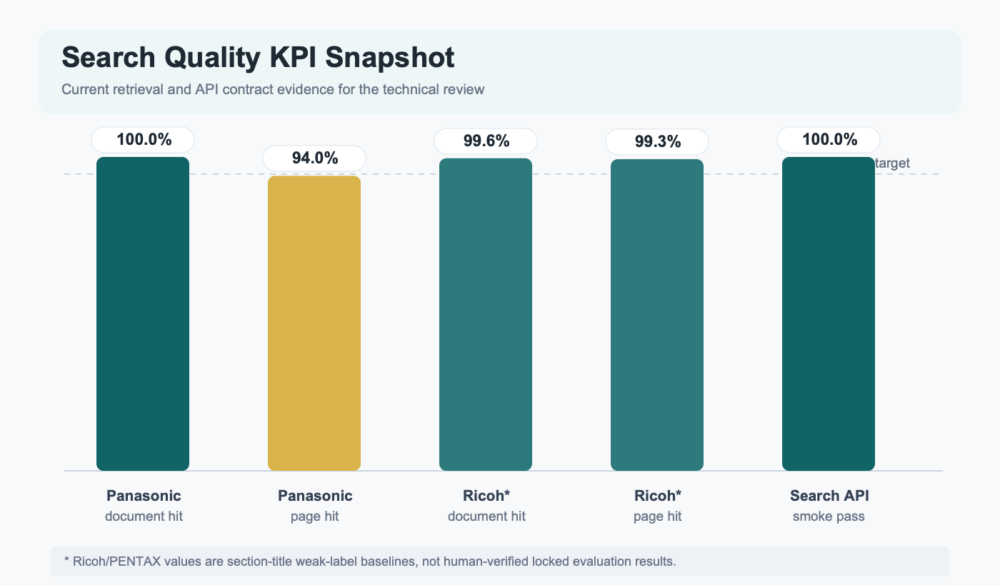
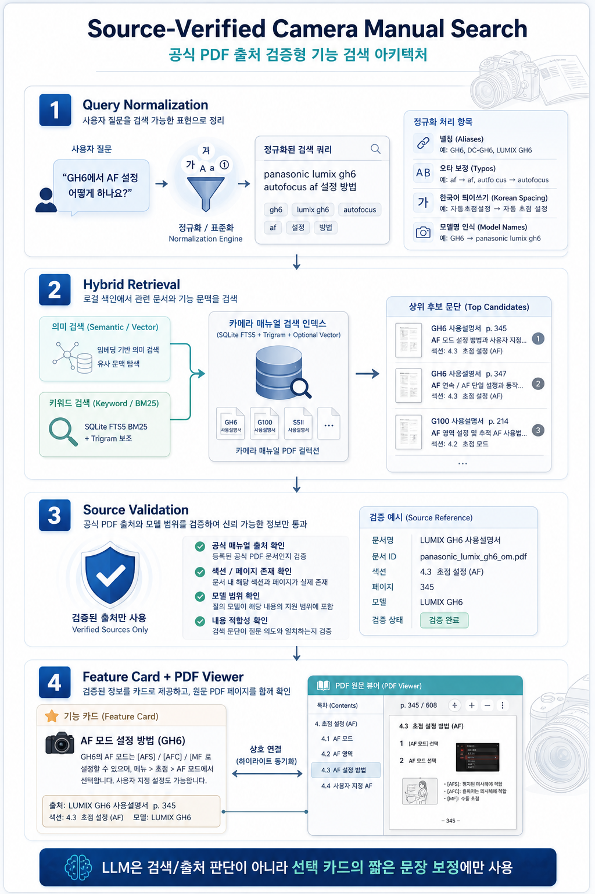

# Camera Manual Assistant 기술 보고서

> 보고 기준: [technical_evidence_matrix.md](technical_evidence_matrix.md), [next_work_roadmap.md](next_work_roadmap.md), [evaluation_report.md](../evaluation/evaluation_report.md), [rag_model_quality.md](../evaluation/rag_model_quality.md)

## 1. 결론

현재 프로젝트는 **LLM 장문 생성형 챗봇**보다 **공식 PDF 출처 검증형 기능 검색 시스템**으로 포지셔닝하는 것이 맞다.

| 핵심 판단 | 현재 결론 | 근거 |
|---|---|---|
| 기본 응답 방식 | `card_template` 유지 | 10문항 alias/source 개선 평가에서 답변 관련성, PDF 충실도, 품질 전체 100.0% |
| LLM 역할 | 기본 검색이 아니라 선택 카드의 짧은 문장 보정 | LLM은 source ref를 수정하지 않고 실패 시 원본 summary 유지 |
| 검색 인프라 | SQLite FTS5 BM25 + trigram 중심 | Panasonic seed/API smoke에서 기준선 충족, 외부 검색 인프라 도입 근거는 아직 부족 |
| 품질 보강 우선순위 | 300개 잠금 평가셋과 출처 정확도 측정 | 현재 50개 seed와 Ricoh weak-label은 최종 품질 주장에는 부족 |

```text
추천 운영 전략

검색/출처 판단      card_template 기본 응답      선택 카드 LLM 보정
     필수                  필수                        선택
  deterministic        deterministic              source 고정
```

## 2. KPI 대시보드



| 영역 | 지표 | 현재값 | 목표/판정 | 상태 |
|---|---:|---:|---|---|
| Panasonic 검색 | Seed cases | 50 | 회귀 기준선 | 기준선 있음 |
| Panasonic 검색 | Document hit | 100.0% | 85% 이상 | 통과 |
| Panasonic 검색 | Page hit | 94.0% | 95% 목표 근접 | 보강 필요 |
| Ricoh/PENTAX 검색 | Weak-label cases | 278 | 참고 기준선 | 사람 검수 필요 |
| Ricoh/PENTAX 검색 | Document hit | 99.6% | 참고 기준선 | 양호 |
| Ricoh/PENTAX 검색 | Page hit | 99.3% | 참고 기준선 | 양호 |
| Search API smoke | API 계약 통과 | 25/25 | 100% | 통과 |
| Search API smoke | 카드 source 존재율 | 100.0% | 100% | 통과 |
| Search API smoke | viewer URL 형식 | 100.0% | 100% | 통과 |
| Search API smoke | 모델 필터 계약 | 100.0% | 100% | 통과 |
| Chunk quality | Flagged chunks | 2,439 / 275,372 | issue rate 0.9% | 관리 가능 |
| 기본 답변 | `card_template` 품질 전체 | 100.0% | 10문항 개선 평가 | 운영 기본값 |
| Optional rewrite | Unsloth E4B answer-only | 100.0% | 10문항 best run | 변동성 있음 |
| Optional rewrite | 평균 지연 | 1.1s-5.8s | 검색 기본 경로에는 부담 | 선택 기능 |

### 검색 품질 스냅샷

```text
Panasonic document hit     100.0% |████████████████████| 통과
Panasonic page hit          94.0% |███████████████████░| 목표 근접
Ricoh document hit          99.6% |████████████████████| weak-label
Ricoh page hit              99.3% |████████████████████| weak-label
Search API smoke           100.0% |████████████████████| 통과
```

## 3. 제품 범위와 데이터 커버리지

| 구분 | Panasonic LUMIX | Ricoh/PENTAX | 해석 |
|---|---:|---:|---|
| 등록 문서 | 32 | 24 | 두 브랜드 모두 registry 기반 관리 |
| 등록 모델 | 34 | 21 | 브랜드별 모델 alias/rules 분리 |
| Ricoh 추출 페이지 | 해당 없음 | 2,967 | Ricoh 신규 브랜드 색인 완료 |
| Ricoh 추출 청크 | 해당 없음 | 70,738 | OCR 포함 색인 기준선 확보 |
| Ricoh weak-label 평가 | 해당 없음 | 278 | 사람 검수 전 후보 평가 |

```text
브랜드 확장 구조

configs/brands.json
  -> data/brands/panasonic_lumix
     -> registry / processed / indexes / page_images
  -> data/brands/ricoh
     -> registry / processed / indexes / page_images
```

평가 관점에서는 Panasonic이 기준 브랜드이고, Ricoh/PENTAX는 동일 구조가 다른 브랜드에도 적용됨을 보여주는 확장 증거다. 단, Ricoh/PENTAX의 278개 평가는 section-title weak-label 기반이므로 외부 품질 주장에는 그대로 쓰면 안 된다.

## 4. 아키텍처 인포그래픽



가로형 원본 인포그래픽은 별도 자산으로 유지한다: [source_verified_search_architecture.png](assets/source_verified_search_architecture.png)

```text
사용자 질문
   |
   v
Query Normalizer
   |  모델명/별칭/오타/붙여쓰기 보정
   v
Hybrid Retriever
   |  SQLite FTS5 BM25
   |  Trigram fallback
   |  Optional vector adapter
   v
Source Validation
   |  document_id + model_id + page 검증
   v
Feature Card Builder
   |  deterministic card_template
   v
PDF Viewer Link
   |  4x PyMuPDF page image + OpenSeadragon
   v
사용자 원문 확인
```

| 계층 | 구현 근거 | 보고서상 의미 |
|---|---|---|
| Backend API | [backend/app/main.py](../../backend/app/main.py), [search.py](../../backend/app/api/routes/search.py) | 웹 MVP의 검색 API 표면 |
| Query normalization | [query_normalizer.py](../../backend/app/services/query_normalizer.py), [korean_text_normalization.py](../../backend/app/services/korean_text_normalization.py) | 한국어 질의 해석의 핵심 |
| Retrieval | [hybrid_retriever.py](../../backend/app/services/hybrid_retriever.py), [fts_schema.py](../../backend/app/indexing/fts_schema.py) | FTS5/BM25 + trigram 기준선 |
| Source validation | [retrieval_source_validation.py](../../backend/app/services/retrieval_source_validation.py), [source_ref_checker.py](../../backend/app/wiki/source_ref_checker.py) | 모델 오염과 근거 없는 답변 방지 |
| Card answer | [rag_model_quality_runner.py](../../backend/app/evaluation/rag_model_quality_runner.py), [retrieval_display_text.py](../../backend/app/services/retrieval_display_text.py) | LLM 없는 안정 카드 응답 |
| PDF viewer | [page_renderer.py](../../backend/app/indexing/page_renderer.py), [viewer.py](../../backend/app/api/routes/viewer.py) | 사용자가 근거 페이지를 직접 확인 |
| Optional rewrite | [answer_rewrite.py](../../backend/app/services/answer_rewrite.py), [card_rewrite.js](../../web/assets/js/card_rewrite.js) | 선택 카드의 자연어 보정 |

## 5. 기술 선택 매트릭스

| 선택지 | 장점 | 현재 리스크 | 판정 |
|---|---|---|---|
| `card_template` 기본 응답 | 빠름, JSON 안정, source ref 고정 | 문장 자연스러움 제한 | 기본값 |
| Selected-card LLM rewrite | 사용자-facing 문장 개선 | latency와 생성 변동성 | 선택 기능 |
| Full LLM answer generation | 자연어 표현력 높음 | source 조작, JSON 불안정, 지연 | 보류 |
| SQLite FTS5 BM25 | 설치 단순, 로컬 빠름, 평가 기준선 양호 | 긴 자연어/의미 검색 한계 가능 | 기본 검색 |
| Trigram fallback | 붙여쓰기/짧은 메뉴명 보완 | 노이즈 후보 증가 가능 | 보조 검색 |
| Optional vector adapter | 의미 검색 확장 지점 | 현재 품질 근거는 약함 | 실험 단계 |
| Elasticsearch/Vector DB | 대규모 검색 확장성 | 운영 복잡도, 아직 정량 근거 부족 | 잠금 평가 후 판단 |

## 6. LLM 평가 요약

| 모드/모델 | 답변 관련성 | PDF 충실도 | 품질 전체 | 평균 지연 | 판단 |
|---|---:|---:|---:|---:|---|
| `card_template` | 100.0% | 100.0% | 100.0% | 0ms | 운영 기본값 |
| Unsloth Gemma-4 E4B answer-only | 100.0% | 100.0% | 100.0% | 1,089ms | optional 1순위 후보 |
| Unsloth Gemma-4 E4B 256-token run | 100.0% | 100.0% | 100.0% | 5,805ms | 품질은 좋지만 지연 부담 |
| Qwen3-4B answer-only | 9.1% | 9.1% | 9.1% | 5,220ms-6,610ms | reasoning 누수로 제외 |
| SuperGemma4 E4B 256-token run | 90.9% | 90.9% | 90.9% | 5,392ms | 후보지만 1순위 아님 |

```text
LLM 운영 경계

허용: 검증된 카드 1개의 answer 문장만 짧게 보정
금지: source ref 생성, page 판단, 모델 지원 여부 판단, 근거 없는 기능 추가
```

## 7. 리스크 히트맵

| 리스크 | 영향도 | 가능성 | 현재 상태 | 대응 |
|---|---|---|---|---|
| 평가셋 부족 | 높음 | 높음 | 50 seed + weak-label 중심 | 300개 locked eval 구축 |
| 출처 페이지 정확도 미측정 | 높음 | 중간 | API 계약은 통과, 사용자 relevance는 별도 필요 | page relevance QA 추가 |
| 모델 혼합 오류율 미측정 | 높음 | 중간 | source/model 구조 검증은 있음 | contamination metric 추가 |
| OCR 품질 편차 | 중간 | 중간 | THETA V OCR 색인 포함 | OCR 문서별 smoke 보강 |
| LLM 지연/변동성 | 중간 | 높음 | 1.1s-5.8s 관찰 | optional rewrite로 제한 |
| 대형 PDF viewer 성능 | 중간 | 낮음 | 4x PNG 단일 이미지 방식 | 필요 시 Deep Zoom tile 검토 |

### 품질 게이트 현황

```text
구현 게이트
[통과] Search API contract smoke
[통과] Source ref structure validation
[통과] PDF page image/viewer route
[통과] Deterministic card answer baseline

보고서 품질 게이트
[부족] 300개 locked human-verified eval
[부족] source page relevance metric
[부족] model contamination rate
```

## 8. 로드맵

| 우선순위 | 작업 | 산출물 | 성공 기준 |
|---:|---|---|---|
| 1 | 검색 평가 재실행 및 숫자 고정 | `search_eval_report.json`, `search_api_smoke_report.json` | 보고서 내 검색 수치 단일화 |
| 2 | 출처 페이지 relevance 평가 | page relevance QA sheet/report | 출처 정확도 95% 목표 측정 |
| 3 | 모델 혼합 오류율 평가 | contamination report | 모델 혼합 오류율 3% 이하 확인 |
| 4 | 300개 locked eval 구축 | human-verified eval set | 최종 품질 주장 가능 |
| 5 | LLM rewrite 운영 조건 고정 | rewrite benchmark + settings | source contract 보존, 지연 허용선 정의 |
| 6 | Feature Wiki/Graph-lite 확장 | source-backed feature cards, relation graph | 검색 MVP 이후 비교/관련 기능 탐색 강화 |

## 9. 기술 검토 결론

Camera Manual Assistant는 현재 **32개 Panasonic 문서와 24개 Ricoh/PENTAX 문서까지 확장 가능한 브랜드별 PDF 검색 구조**를 갖추었고, **Search API smoke 25/25 통과, Panasonic document hit 100.0%, Ricoh weak-label document hit 99.6%**를 기준선으로 확보했다. 다만 외부 발표용 품질 주장은 **300개 사람 검수 평가셋, 출처 페이지 relevance, 모델 혼합 오류율**을 추가 측정한 뒤 확정하는 것이 적절하다.
